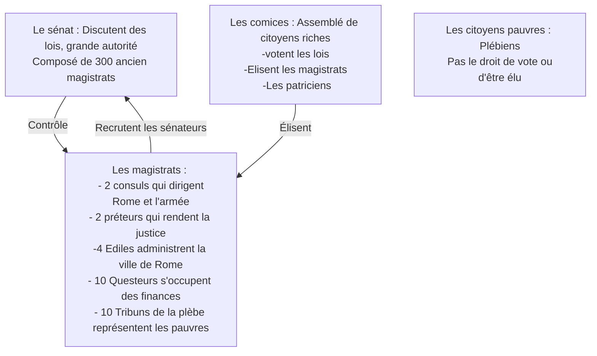

---
config:
  theme: 'dare'
---

# Intro 
- L'antiquité commence aveec le début de l'écriture (-3500) et se termine avec la chute de l'empire Romain d'Occident (476)
- Méditerrannée Antique : Berceau de nombreuses civilisations (grecques, egyptiennes, perse, ...)
- Les civilisations grecques et romaine ont laissé de nombreuses empreintes encore présentes de nos jours 
Civilisations : ensemble de caractéristiques, culturelle, religieux, politiques, artistiques, techniques communes à une région et à une ou plusieurs societé
Problématiques : Quels héritages Athènes et Rome ont-elles laissés au monde actuel ? 

# I/ Athènes et la démocratie au Vème siècle 
- Un personnage : Périclès
- Un lieu : Athènes
En -500 il y avait plusieurs cité independants 
    - Propre régime politique / lois / monnaie
    - Elles se font souvent la guerre 
    - Une des plus puissantes est Athènes

## A/ Periclès et la démocratie athénienne 
- La démocratie : au grec demos le peuple et kratos, le pouvoir : un régime politique ou le pouvoir appartient à l'ensemble des citoyens  

Réunie sur la colline de la Pnyx, Ecclésia, l’assemblée de tous les citoyens (environ 40 000 pour environ 260 000 non-citoyens), vote les lois préparées par la boulé et vote ostracisme, c’est-à-dire la condamnation à l’exil pendant 10 ans d’un citoyen jugé dangereux pour la démocratie. Elle décide aussi de la guerre. Chaque citoyen peut prendre la parole au sein de l’assemblée.
L’Ecclésia:  
- tire au sort les membres de la boulé, un conseil de 500 citoyens.  
- tire au sort les 6000 membres de l’héliée, qui est un tribunal de justice.  
- élit ou tire au sort les magistrats, les dirigeants de la cité qui font appliquer les lois, renouvelés tous les ans. Les plus importants sont les 10 stratèges, qui dirigent l’armée et sont élus.  
La Boulé et l’Héliée contrôlent les magistrats, c’est-à-dire qu’ils vérifient s’ils remplissent bien leur mission.

### Limites de la démocraties et démocratie directe
Cependant la démocratie athénienne connaît plusieurs limites. L’une des plus importantes est le nombre limité de citoyens par rapport à la population totale. En effet les enfants, les étrangers et les esclaves sont exclus de la citoyenneté, et ils sont donc aucun droit politque : seulement 30 000 personnes sur 340 000 sont citoyens. 

La démocratie athénienne est une démocratie directe car ce sont les citoyens qui gouvernent et font les lois.  
La pratique du tirage au sort et le renouvellement fréquent des personnes politiques montre que chaque citoyen est jugé apte à exercer une fonction publique.  
L’Ecclésia est composé de tous les citoyens, et va tirer au sort certains magistrats, qui sont les dirigeants de la cité.

## L'empire maritime athénien au Vème siècle avant J.-C.
1) Contre qui les cités grecques se battent-elles au début du Ve siècle avant J.-C. ? Comment nomme-t-on ces guerres ? Citez et datez deux batailles importantes durant ces guerres. Qui remporte ces guerres ?  
   
> Les cités grecques vont se battre contre l’empire perse. Les ce sont les guerres médiques avec leurs batailles principales, étant la bataille de Marathon en -490 et la bataille de Salamine (-480), ce elles sont remportées par les Grecs.  

2) Comment s’appelle l’alliance établie entre Athènes et plus de 200 cités autour de la mer Égée ? Selon vous, quelles sont les raisons de la mise en place de cette alliance ?  

> Athènes va former une alliance appelée ligue de Délos pour pouvoir gagner la guerre contre les perses et empêcher une nouvelle invasion perse.  

3) Quelles sont les obligations faites aux habitants de la cité de Chalcis par Athènes ? Pourquoi peut-on parler de domination d’Athènes et d’assujettissement des cités alliées au sein de la Ligue de Délos ?  

> Les athéniens proposent à leurs alliés de mener les opérations militaires En échange les cités comme Chalcis doivent jurer fidélité à Athènes et payer la tribut, une somme d’argent destinée à entretenir la flotte et l’armée d’Athènes. C’est le trésor de la ligue de Délos.  
> En cas de non-respect des « conditions » la cité alliée perd la protection et les traités sont privés de leurs droits et biens. 

4) À quoi sert l’argent / le tribut versés par les cités alliées d’Athènes selon l’auteur du document ? Comment Périclès justifie-t-il cette utilisation du trésor de la Ligue de Délos ?  
> Démocratie Athénienne: embellissement cité
> 
>   - Rameur sur les trières (citoyens pauvres)  
>   - Le Misthos 
>   - Financer la construction de bâtiments (panthéon, -448 et -437) plus grand temple de Dorique d’Afrique du monde grec (70mx31m)  

5) D’après ce document, la domination de la Ligue de Délos par Athènes entraîne quelle réaction parmi les cités alliées ? Quelle est la réponse d’Athènes dans le cas de Mytilène ? Comment l’expliquer ?  
   
> Ligue de Délos = Domination d’Athènes, impose la démocratie, garnisons de soldats athéniens et sa monnaie → Développement d’un **impérialisme** athénien  
> 
> **Impérialisme** : Domination exercée par un état 
> 
> La domination permet à Athènes prosperité et sérénité mais contestations et révolte par d'autre cité, reprimé par Athènes (montrer l'exemple et grader sa puissance)

6) Qu’est-ce qui peut paraître contradictoire entre le fonctionnement démocratique de la cité d’Athènes et sa politique extérieure ?  
> En terme de politique intérieure, Athènes est une démocratie où chaque citoyen peut s’exprimer librement alors que dans sa politique extérieure, Athènes agit comme un empire et exige la soumission des cités de la Ligue de Délos.  

> La cité de Sparte et ses alliés tentent de mettre fin à l’impérialisme athénien. En -431 commence la guerre du Péloponnèse entre Athènes et Sparte:  
> 
> - Guerre de + de 25 ans  
> - Mort de Périclès (Peste)  
> - Renversement de la démocratie athénienne à 2 reprises  
> - 404, défaite d’Athènes  

Au Ve siècle av. J-C, les Athéniens ont mis en place une véritable thalassocratie ("pouvoir sur les mers") en mer Égée.  

La Grèce antique a laissé un héritage important dans l’histoire du monde, notamment dans l’Europe: un exemple de démocratie, les temples et les structures grecques, l’invention du théâtre, de la philosophie et de l’histoire, les progrès dans les mathématiques et la médecine.

# II/ Rome de la République à l’Empire  
Selon Tite-Live ou Virgile Rome fondée en 753 av. JC. Mais la chronologie remonte question cette date.

D'abord Rome est comme Athènes $\rightarrow$ cité état (ville + campagne) 
- Au début, des rois règnent sur Rome 
- Puis à partir de -509 c'est une république (respublica, la chose publique) 

- Rome $\neq$ une démocratie, mais une "**Oligarchie**", seul les citoyens les plus riches qui participent à la vie politique. 
- Rome est la République la plus longue/durable de l'histoire (-509 à -27)

## A/ Rome : de la cité républicaine à la cité Impériale 
République romaine : conquière de larges territoires autour de la mer Méditerranée

- Territoire protégé par un mur/ frontière physique : "le limes" qui sépare le monde Romain civilisé et le monde "barbare" 

La conquête de cet empire territorial provoque une crise politique de la République Romaine au 1er siècle av JC. Des généraux s'affrontent pour obtenir le pouvoir, entraînant de nombreuses guerres civiles au 1er siècle av JC qui se terminent par la victoire d'Octave, fils adoptif de César face à Marc Antoine à la bataille d'Actium en -31. 

Octave restauré la paix et le sénat lui attribue le titre d'Auguste.

2/ Auguste a le pouvoir pouvoir absolu (politique, militaire, religieux, législatif) 

3/ Octave se fait maintenant appeler Auguste par le sénat et par le peuple 

4/ Le culte impérial : divinisation d'Auguste après sa mort, prêtres et cérémonies en son honneur, construction de sanctuaires et de temples, statues en or. Cela n'apparaît pas dans le texte d'Auguste lui-même. 

Auguste présente son pouvoir comme une continuité, tandis que Don Cassius y voit la fondion d'un régime monarchique

Auguste ne fait pas disparaître la République mais il s'attribue les pouvoirs 

**Principat** : 

- Régime politique fondé par Octave/Auguste (vient de "principes", le premier des citoyens) dans lequel le principes exerce un pouvoir personnel et dynastique.
- Empire $\rightarrow$ Empereur : pouvoir divers (dirige état, nomme sénateurs, magistrats, chefs de la religion, chef des armées, il fait les lois et la justice). 

## B/ L'organisation et la gestion de l'empire Romain 
Comment l’Empire romain est-il unifié et intégré malgré la diversité des peuples qui le composent ?

- Par la diffusion du modèle de la cité
  - La cité Romaine permet trois choses : 
    - Imposer le mode de vie à la Romaine grâce à des batiments de vie (bains, arènes)
    - Permettre une vie politique active (assemblée...)
    - Donner une éducation civique aux peuples nouvellement conquis
- Par le développement d'un important réseau de transport
  - Réseau routier qui permet plusieurs choses : 
    - Faciliter les mouvements de l'armée
    - Faire parvenir du courrier et des ordres administratifs rapidements
    - Faciliter le commerce dans l'empire
    - Création de la poste
- Par la diffusion du culte impérial
  - Culte impérial permet : 
    - Culte obligatiore dans l'Empire
    - Unification de toutes les catégories sociales
    - La reconnaissance de l'Empereur dans tout l'Empire
    - Un culte partage autour d'un personnage important malgré les différences religieuses
- Par la diffusion de la citoyenneté romaine
  - A partir de 212, la citoyenneté Romaine est ouverte à tous les hommes de plus de 21ans.
  - Pour l'obtenir, il faut : 
    - Etre recensé (pour être rattaché à une cité)
    - Etre prêt à servir dans une légion (faire l'armée) ou être riche
    - Il faut être libre
- Par tolérance religieuse
  - Religion Greco-Romaine $\rightarrow$ polythéiste
    - Basé sur un panthéon de "base" auquel s'ajoute des dieux venus de provinces conquise par Rome. 
    - Basé sur des sacrifices et des rites et non pas sur un dogme
    - Mais deux religions à l'écart : Judaïsme et Christianisme

Ils construisent des villes selon le modèle de Rome, avec des forums, des thermes, des temples, des amphithéâtres, etc.

Les élites locales adoptent la culture romaine, le latin, le mode de vie romain.

$\rightarrow$ Cela renforce leur attachement à l’Empire.

# III/ La diffusion du christianisme dans l'Empire 

## A/ D'une religion persécuté à la religion officielle de l'Empire Romain 

Contexte : Christianisme né au 1er siècle après JC en actuelle Palestine

Au 1er siècle un juif de Galilée nomme Jésus parcourt la Palestine. Il se proclame fils de Dieu et envoyé du seigneur (le "Messie") Il annonce la "bonne nouvelle". 
Il est finalement tué par les Romains
$\rightarrow$ ses disciples, les apôtres diffusent la religion chrétienne.

Le christianisme, comme le judaïsme, est une religion monothéiste révélée: croyance en un seul Dieu et en un livre sacré, la Bible (Deux parties: Ancien et Nouveau Testament).  

Chrétiens mal vus car pas de participation à la religion Romaine et au culte impérial.  
  
Accusés de défier les dieux → persécutions du Ier au IIIe siècle et des violences généralisées sous les empereurs Valérien et Dioclétien au début du IVe siècle.  

Depuis la fin du IIIe siècle, Empire Romain dirigé par plusieurs empereurs.  

**En 306**, Constantin est proclamé empereur par ses troupes mais il doit battre les autres prétendants.  
 
**En 312**, il a réussi à vaincre l’un d’eux Maxence, près de Rome. Selon la tradition chrétienne, il aurait reçu une vision de Dieu qui lui promettrait la victoire s’il arborait le chrisme sur ses étendards $\rightarrow$ il devient empereur.  

**312**: Édit de Milan, liberté de culte dans l’Empire Romain.  

**325**: Conseil de Nicée: fixe le dogme (les croyances chrétienne et la date de Pâques). 

Constantin fait installer des églises a Constantinople et se baptiser juste avant notre mort.

**381** : L'empereur Théodose met en place l'Edit de Thessalonique qui interdit les religions polythéistes et qui fait du christianisme la religion officielle de l'Empire Romain 

## B/ la christianisation de l'Empire Romain

La conversion de Constantin marque un tournat dans l , histoire du christianisme et de l'Empire romain : le christianisme est devenu la religion officielle ; l'Eglise occupe une place importante au sein de la société ; le christianisme continue de se diffuser dans l'Empire romain (surtout en Occident) et hors de l'Empire romain et des divergences apparaissent entre l'Orient et l'Occident (Occident moins christianisé ; Eglise moins présente et structurée qu'en Orient)

# Conclusion

La Méditerranée antique a laissé un important héritage dans différents domaines du monde actuel 

- Héritage politique : Expérience démocratique, l'idée de république 
- Héritage culturel : architecture, sculpture, littérature, philosophie, mathématiques,...
- Héritage religieux : Naissance des premieres religions monothéistes et leur diffusion mondiale. 
