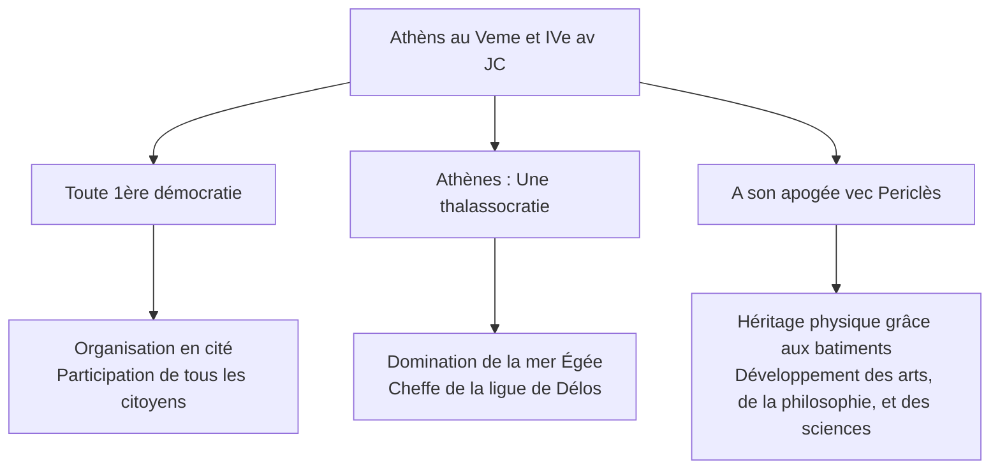

# Date importantes à Athènes

- -495 à -429 : Périclès
- -508 à -338 : Démocratie à Athènes 

# Personnages importants
## Périclès (-495 à -429)
- Homme politique le plus influent 
- Stratège 15 fois d'affilé
- Il transforme les institutions d'Athènes (Misthos)
- Il étend l'influence de la ligue de Délos
- Meurt de la peste

# Dates importantes à Rome 
- -27 à 476 : Empire Romain d'Occident
- -27 à 14 : Règene d'Octave-Auguste
- 312 : Victoire de Constantin sur Maxence
- 325 : Concile de Nicée
- 381 : Edit de Thessalonique
- 312 à 337 : Règen de Constantin 
 

|                  Auguste                  |                   Constantin                   |
| :---------------------------------------: | :--------------------------------------------: |
|         -63 av J-C à 14 après J-C         |              272 à 337 après J-C               |
|       - Fils adoptif de Jules César       |              - Élimine ses rivaux              |
| - Bat Marc Antoine à Actium en -31 av J-C |          - Autorise le culte chrétien          |
| - Lutte contre les assassins de son père  | - Fait de Constantinople une deuxième capitale |
| - Fondateur du Principat (Empire) en -27  |     - Baptisé en 337 juste avant de mourir     |
|         - PREMIER EMPEREUR ROMAIN         |                                                |
